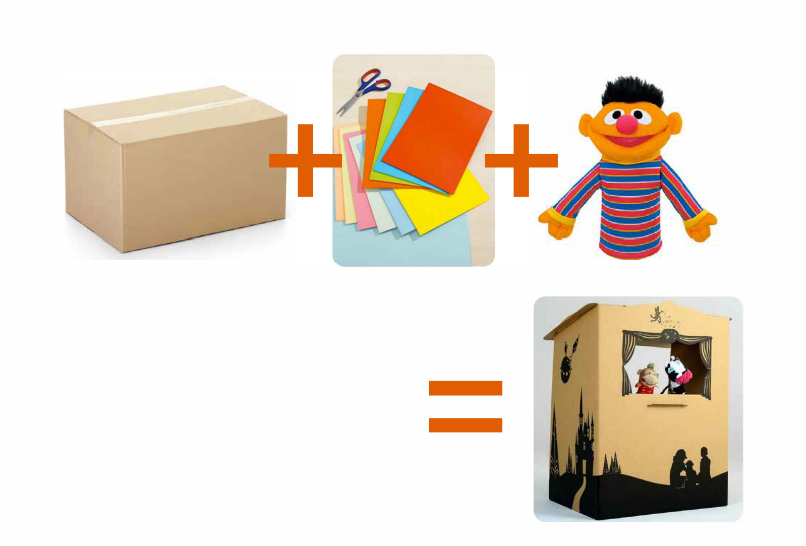
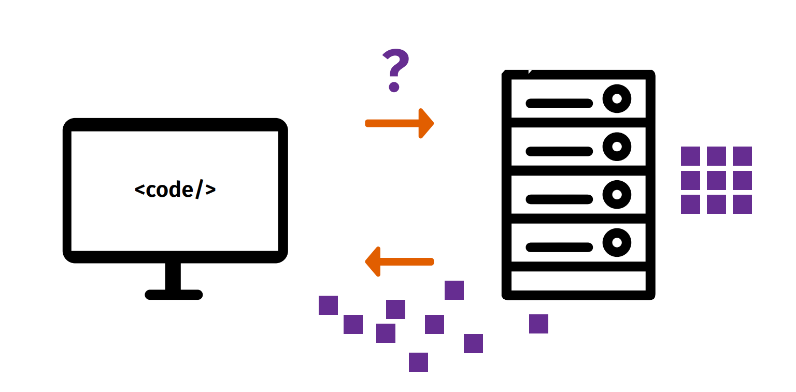
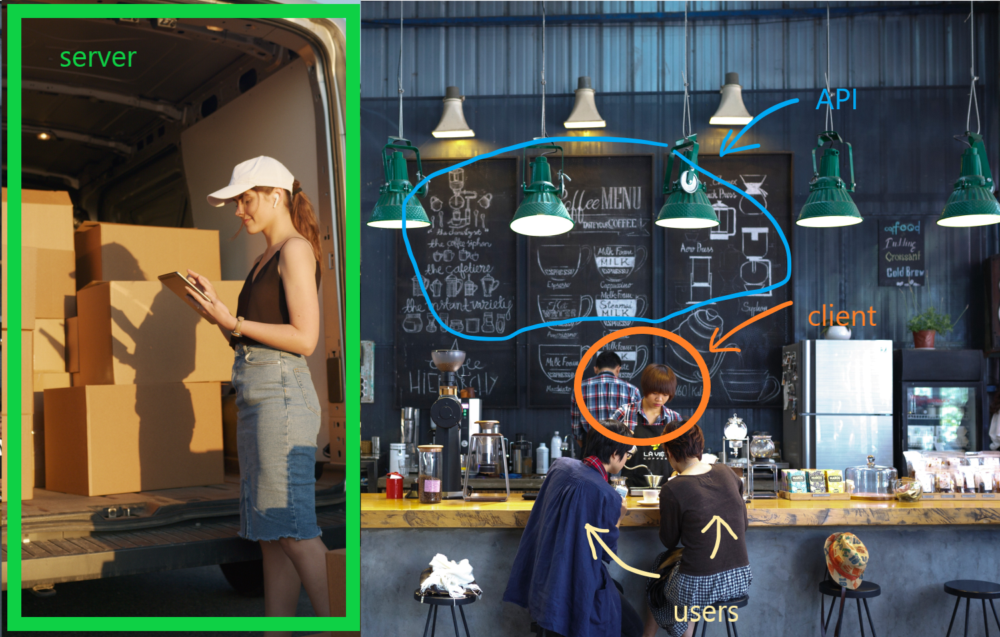

# Overview of the class:

1. **Browser environment**

- HTML vs CSS vs JS
- Client vs server
- Where is the script tag being loaded

2. **DOM**

- What is it and what do developers use the DOM for?
- DOM manipulation

3. **Event listeners**

# Browser environment

#### HTML :point_right: structure

_HyperText Markdown Language_ = markdown of the structure of your website/webapp

#### CSS :point_right: styles

_Cascade Style Sheets_ = markdown of the styles for the HTML structure

#### JS :point_right: functionality

_JavaScript_ = script for the functionality, interactivity, any communication with the user, etc. All the fun stuff.

Overview: [FreeCodeCamp - HTML, CSS, JS explained](https://www.freecodecamp.org/news/html-css-and-javascript-explained-for-beginners/)

### Wait, but what is a browser... :confused:

Let's explore!
[BrowserStack - What is a browser](https://www.browserstack.com/guide/what-is-browser)

## Client vs Server

### Client

Client inteprets the information to display a coherent UI. Client gathers user input and communictes it to the server.

### Server

Server has direct access to the data storage and all the logic responsible for accessing it and serving that to the client.

### Explanation through analogy

1. Server has all the supplies.
2. Client sends requests to the server to get particular supplies.
3. Client is responsible by preparing the received supplies according to some rules and serving them pretty to the users.
4. Users don't know much and **should not** know much about the server.
5. What's an API? This info is coming soon!

### Where is the JavaScript doing the work then?

It can be both client and server!
Today we focus on the client only and this is where the JS will be used to manipulate our websites in a **dynamic** way.

## How to use JS in your web page?

Where to put it, in what order and why it matters.

1.  [Script tag docs](https://developer.mozilla.org/en-US/docs/Web/HTML/Element/script)
2.  [Example](./exercises/loading_tags/loading.html) from [this website](https://www.tutorialsteacher.com/javascript/script-tag).
3.  **Beginners explanation**: script tags are loaded consecutively, just like any other HTML tag. Therefore script inserted in the `<head>`element will be executed before any of the UI is interpretet by the browser.
4.  **Advanced explanation**: [Optimizing JS execution](https://medium.com/sessionstack-blog/how-javascript-works-the-rendering-engine-and-tips-to-optimize-its-performance-7b95553baeda) (proceed with caution! :dizzy_face:)

# DOM (Document Object Model)

## What is DOM

[Wikipedia](https://en.wikipedia.org/wiki/Document_Object_Model) knows the answer.

## How can we use it

[MDN](https://developer.mozilla.org/en-US/docs/Web/API/Document_Object_Model) to the rescue. Let's use the docs to find out!
[Code inspiration from HYF](https://github.com/HackYourFuture-CPH/JavaScript/blob/main/javascript2/week1/lesson-plan.md#image-inserter)

## Exercises:

[Template](./exercises/manipulating_DOM/index.html)

1. [Favourite dishes](https://github.com/HackYourFuture-CPH/JavaScript/blob/main/javascript2/week1/lesson-plan.md#favorite-dishes) (together in class)
2. [Podcast](https://github.com/HackYourFuture-CPH/JavaScript/blob/main/javascript2/week1/lesson-plan.md#podcast)
3. [Image inserter](https://github.com/HackYourFuture-CPH/JavaScript/blob/main/javascript2/week1/lesson-plan.md#image-inserter)

# Event listeners

[Example from HYF](https://github.com/HackYourFuture-CPH/JavaScript/blob/main/javascript2/week1/lesson-plan.md#eventlistener)

## What are events?

Predefined actions/user behaviors, such as: using the peripherals (keyboard, mouse), manipulating browser windows, leaving the browser, etc.

## What does it mean "event listener"?

It is a small function used to **subscribe** to an event. Subscribing means telling our browser that on certain event we want a custom function to be executed (on top of default event behavior).

1. What does _default behavior_ mean?
2. What is the default _argument_ of the listener function and how can we use it? [MDN docs on EventListeners](https://developer.mozilla.org/en-US/docs/Web/API/EventTarget/addEventListener)

## Exercise!

[Exercise](https://github.com/HackYourFuture-CPH/JavaScript/blob/main/javascript2/week1/lesson-plan.md#simple-eventlistener)
